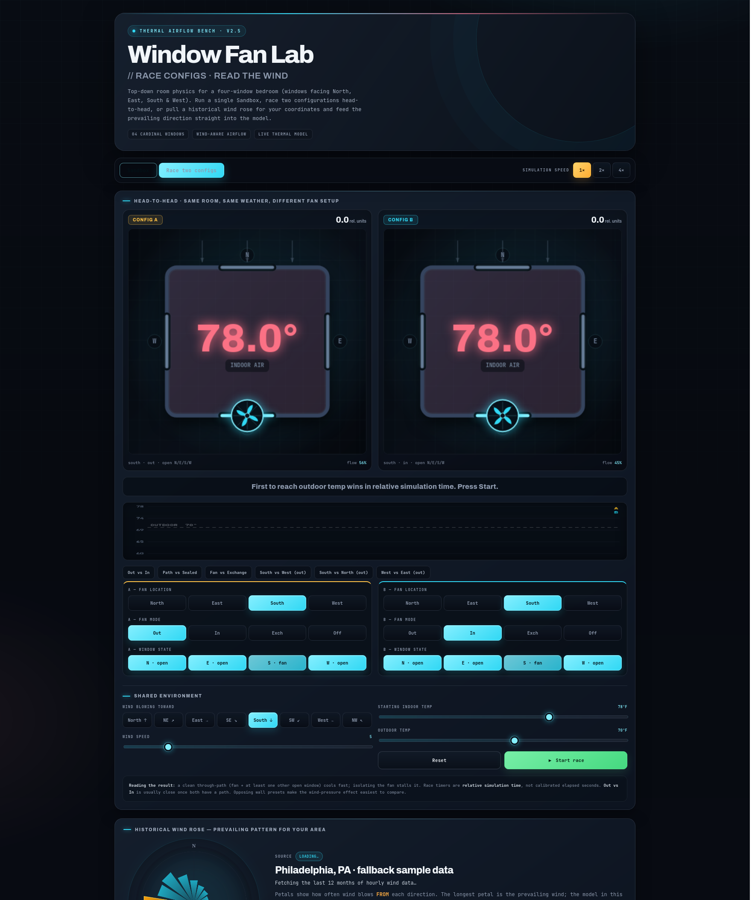

# Window Fan Lab

Window Fan Lab is a single-page browser tool for comparing window-fan setups in a
four-window bedroom. It provides a lightweight airflow simulation, a head-to-head
race mode, and a historical wind rose.

## Screenshots

**Sandbox** — explore one configuration and watch the room cool:


**Race mode** — two configurations head-to-head under the same weather:



## Features

- Explore fan location, fan direction, individual window states, wind direction,
  wind speed, and indoor/outdoor temperature in the sandbox.
- Compare fan placement across North-, East-, South-, and West-facing windows.
- Race two fan configurations under the same conditions.
- Load a historical wind rose for a latitude and longitude using the free
  [Open-Meteo](https://open-meteo.com/) archive API.
- Apply prevailing or manually entered wind conditions to the simulation.

## Run Locally

There is no build step and no package installation.

```bash
cd /path/to/window-fan-lab
python3 -m http.server 8000 --bind 127.0.0.1
```

Then open:

```text
http://localhost:8000
```

The local server is required because the app uses native JavaScript modules. It
also gives the browser a normal web origin for network and geolocation features.

## Tests

The airflow model has a small Node test suite with no package installation.

```bash
node --test
```

## Data And Privacy

- Historical wind data is requested from Open-Meteo for the default Philadelphia
  sample on startup and whenever you submit coordinates. Responses are cached in
  `localStorage` for 24 hours so repeat visits don't refetch.
- Font files are requested from Google Fonts when the page loads.
- Browser geolocation is used only when you choose the location button.
- The project has no backend.

## Limitations

The airflow model is intended for comparison and intuition. It is not an HVAC
load calculation, a CFD simulation, or a substitute for indoor-air-quality
guidance. Windows can be opened or closed individually, and the visualization
shows the dominant pressure-assisted airflow path.

## Repository Layout

```text
.
├── .github/
│   └── workflows/
│       └── test.yml
├── .gitignore
├── .nojekyll
├── LICENSE
├── README.md
├── index.html
├── styles.css
├── js/
│   ├── app.js
│   ├── charts.js
│   ├── dom.js
│   ├── draw.js
│   ├── model.js
│   ├── race.js
│   └── wind-rose.js
├── screenshots/
│   ├── race.png
│   └── sandbox.png
└── tests/
    ├── app-contract.test.js
    ├── controllers.test.js
    └── model.test.js
```

## GitHub Pages

The `index.html` filename allows GitHub Pages and local web servers to load the
app automatically from the project root. The `.nojekyll` marker keeps the Pages
deployment on the plain static-site path.

## License

Licensed under the [MIT License](LICENSE).
